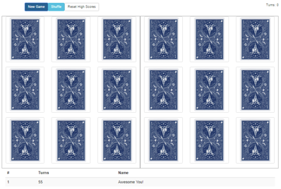
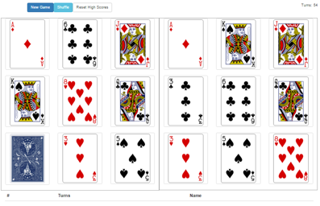
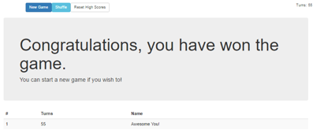

# Card Game using React, Redux and Node

## Screenshots

## Requirements

Install `yarn`, read how [here](https://yarnpkg.com/en/docs/install).

## Installation

Navigate to project root directory and run the following commands:

1. `yarn install`
2. `npm i -g babel-core babel-watch`

To start the application you can now run: `yarn start`

## Available commands

- `yarn lint` Run code linting
- `yarn test` Run tests using jest
- `yarn test-coverage` Run tests using jest and display coverage
- `yarn build` Bundle the application
- `yarn start` Run the development environment
- `yarn deploy` Build the application in production mode
- `yarn deploy-windows` Build the application in production mode under Windows
